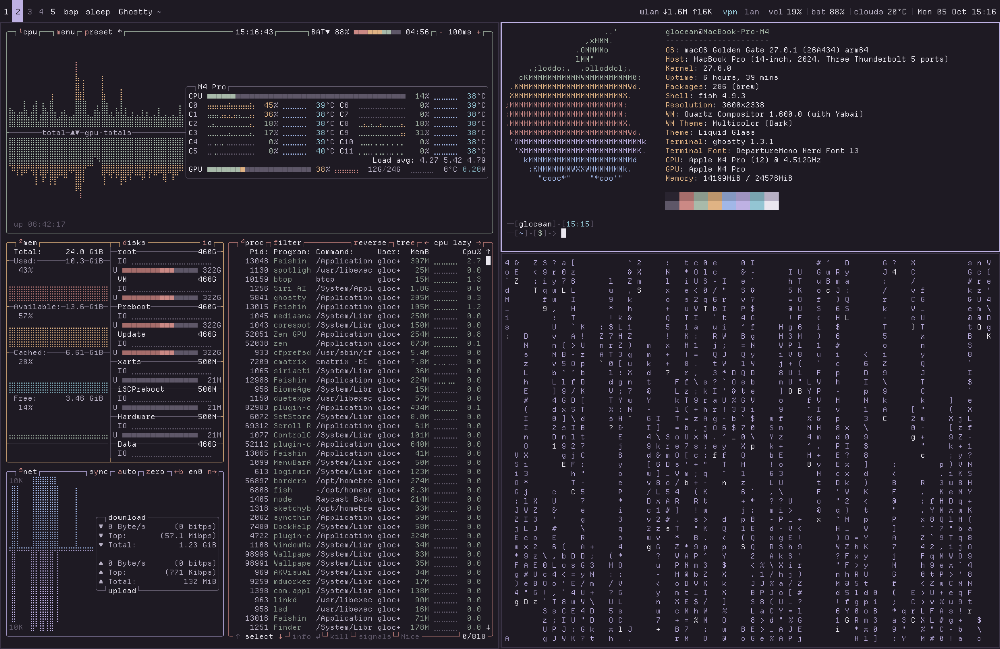

# 0px

<picture>
  <source media="(prefers-color-scheme: light)" srcset="assets/0px-light.png">
  <source media="(prefers-color-scheme: dark)" srcset="assets/0px-dark.png">
  
</picture>

A flat and square macOS rice with minimal distractions. Inspired by early dwm/i3 rices, uses the [Meadow](https://glocean.dev/meadow/) colors.

Here's an overview of the setup:

- **Operating System**: [macOS 27](https://www.apple.com/os/macos/)
- **Window Manager**: [yabai](https://github.com/asmvik/yabai)
- **App Borders**: [JankyBorders](https://github.com/FelixKratz/JankyBorders)
- **Hotkeys**: [skhd](https://github.com/asmvik/skhd)
- **Status Bar**: [Sketchybar](https://github.com/FelixKratz/SketchyBar)
- **Terminal**: [ghostty](https://github.com/mitchellh/ghostty)
- **Shell**: [fish](https://fishshell.com/)
- **Resource Monitor**: [btop](https://github.com/aristocratos/btop)
- **Font**: [Departure Mono](https://departuremono.com/) (Nerd Font build)
- **Color Scheme**: [Meadow](https://glocean.dev/meadow/), Meadow and Meadow Light

## Details

### Weather

The weather module needs an [OpenWeather](https://openweathermap.org/api) API key. After signing up, grab your key [here](https://home.openweathermap.org/api_keys) and put it in `~/.config/sketchybar/sketchybar_env`:

```bash
export API_KEY="your_api_key_here"
```

> [!NOTE]
> A fresh key can take 20-30 minutes to activate.

### Square corners

`setup.sh` sets the window corner radius for you:

```bash
defaults write -g NSConvolutionOverride1 -float 0.001
```

A flat `0` means "default" (20), so it has to be a hair above. Log out and back in for it to apply, or run `killall Finder`. To go back, `defaults delete -g NSConvolutionOverride1`.

### Keyboard Shortcuts

I highly suggest binding `capslock` to `control + option + command` using [Karabiner-Elements](https://karabiner-elements.pqrs.org/), since that combination of keys is used as the modifier key for my yabai/skhd config. After installing, go to Complex Modifications -> Add Your Own rule -> And paste the following:

```
{
    "description": "Caps lock key -> hyper key without shift (⌘⌥⌃), Escape when tapped",
    "manipulators": [
        {
            "from": {
                "key_code": "caps_lock",
                "modifiers": { "optional": ["any"] }
            },
            "to": [
                {
                    "key_code": "left_command",
                    "modifiers": ["left_option", "left_control"]
                }
            ],
            "to_if_alone": [{ "key_code": "escape" }],
            "type": "basic"
        }
    ]
}
```

Additionally, pressing `capslock` normally will register it as the `esc` key, which is useful for vim users.

## Installation

Clone this repository to `~/.config`, then run the setup script:

```bash
git clone https://github.com/gloceandotdev/0px.git ~/.config
bash ~/.config/setup.sh
```

The script installs all dependencies via Homebrew (including the font), sets fish as the default shell, configures the yabai scripting addition, sets the corner radius, and sets up the dark-notify LaunchAgent for automatic theme switching.

> [!NOTE]
> SIP must be partially disabled for yabai's scripting addition to work. See the [yabai wiki](https://github.com/asmvik/yabai/wiki/Disabling-System-Integrity-Protection) for instructions. After upgrading yabai, re-run the sudoers section of `setup.sh`.
